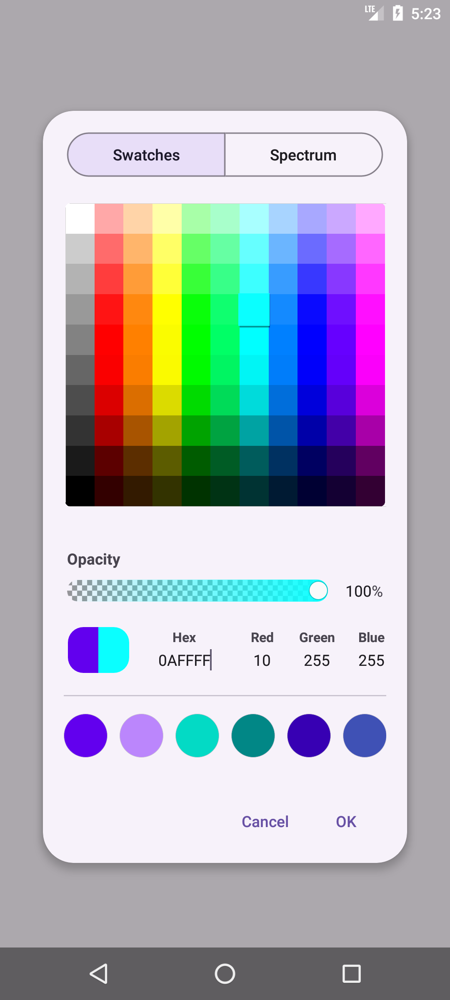
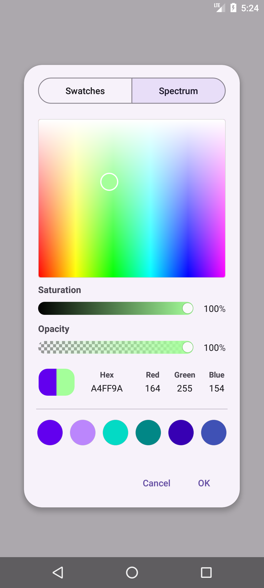
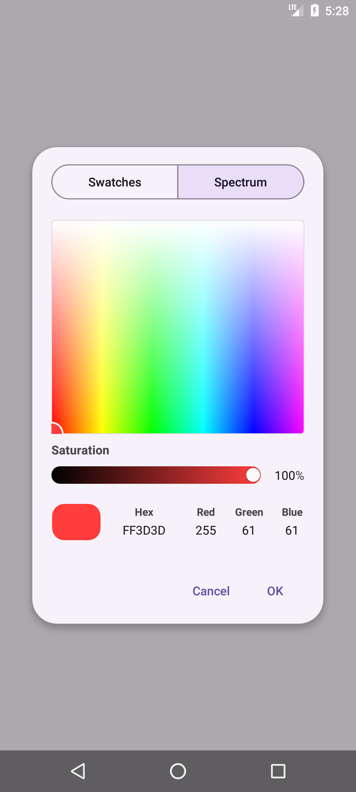

# MaterialColorPicker

[](https://jitpack.io/#AliBinkhani/MaterialColorPicker)
[](LICENSE)
[](https://kotlinlang.org)

A Material 3 color picker for Android, shipped as **two independent libraries** you can pick from depending on your UI toolkit:

| Module | Toolkit | API | Artifact |
|---|---|---|---|
| [`materialColorPicker`](#materialcolorpicker-view-based) | Classic Views | `AlertDialog` builder + embeddable `View` | `views` |
| [`materialColorPickerCompose`](#materialcolorpickercompose-jetpack-compose) | Jetpack Compose | Composables + `Dialog` | `compose` |

The two modules **share no code and no dependency on one another** — `materialColorPickerCompose` is a from-scratch Compose implementation, not a wrapper around `materialColorPicker`'s views. Each is published as its own artifact on [JitPack](https://jitpack.io), so you only pull in what you actually use (in particular, using the Compose picker never pulls AppCompat/Material Views into your app, and using the View picker never pulls in Compose).

The UI and interaction model of both are inspired by the **Samsung OneUI Color Picker** and adapted from the [OneUI-Design-Library](https://github.com/OneUIProject/OneUI-Design-Library) project.

## Screenshots

| Swatches | Spectrum | Spectrum (no opacity bar) |
|---|---|---|
|  |  |  |

*(Screenshots above are of the View-based picker; the Compose picker follows the same visual design.)*

## Installation

Both artifacts are distributed via [JitPack](https://jitpack.io) from this same repository.

**1. Add the JitPack repository** in your project's `settings.gradle.kts`:

```kotlin
dependencyResolutionManagement {
    repositories {
        google()
        mavenCentral()
        maven { url = uri("https://jitpack.io") }
    }
}
```

**2. Add the dependency/dependencies** you need to your module's `build.gradle.kts`:

```kotlin
dependencies {
    // View-based picker
    implementation("com.github.alibinkhani.materialcolorpicker:views:1.0.0")

    // Jetpack Compose picker
    implementation("com.github.alibinkhani.materialcolorpicker:compose:1.0.0")
}
```

Add either one, or both if your app has mixed Views/Compose UI. Replace `1.0.0` with the latest tag — see the [JitPack page](https://jitpack.io/#AliBinkhani/MaterialColorPicker) for available versions.

> **Maven Central:** neither library is published to Maven Central yet. This section will be updated with `mavenCentral()` coordinates once a release is available there — JitPack works out of the box in the meantime.

---

## `materialColorPicker` (View-based)

[](https://android-arsenal.com/api?level=24)

A drop-in `AlertDialog` and a standalone, embeddable `View`, built on AndroidX and Material Components.

### Features

- Material 3 look and feel that follows your app's theme (light/dark, dynamic color)
- Two selection modes: a **Swatches** grid and an **HSV Spectrum** wheel with a hue/saturation gradient slider
- Optional **opacity (alpha)** slider
- Direct **Hex** and **RGB** input fields, kept in sync with every other control
- **Recently used colors** row with automatic slot management
- **Current vs. New** color comparison
- Ships as both a `MaterialColorPickerDialogBuilder` (drop-in `AlertDialog.Builder`-style API) and a `MaterialColorPickerView` (embed anywhere in your layout)
- Full RTL support and layouts tuned for phones, tablets, and landscape orientation
- Localized into 89 languages
- No third-party color-picker dependency — built purely on AndroidX + Material Components

### Requirements

- `minSdk 24` (Android 7.0) or higher
- A Material Components / Material 3 theme (`Theme.Material3.*` or a `MaterialComponents` descendant)
- Kotlin project (Java consumers can use the library as well, since the public API is plain Kotlin/Java-interop friendly)

### Usage

#### 1. `MaterialColorPickerDialogBuilder`

The quickest way to let users pick a color — mirrors the familiar `MaterialAlertDialogBuilder` API.

```kotlin
MaterialColorPickerDialogBuilder(context)
    .setTitle("Choose a color")
    .setRecentColorEnabled(true)
    .setRecentColors(Color.RED, Color.GREEN, Color.BLUE)
    .setOpacityBarEnabled(true)
    .setNewColor(currentColor)
    .setOnColorChangeListener { color ->
        // Called live, on every change while the dialog is open
    }
    .setPositiveButton("OK") { _, _, color ->
        // Called with the final selected color
        applyColor(color)
    }
    .setNegativeButton("Cancel", null)
    .show()
```

##### Builder API reference

| Method | Description |
|---|---|
| `setTitle(...)` / `setCustomTitle(...)` | Dialog title, forwarded to the underlying `MaterialAlertDialogBuilder` |
| `setMessage(...)` | Optional message shown above the picker |
| `setIcon(...)` / `setIconAttribute(...)` | Dialog icon |
| `setBackground(...)`, `setBackgroundInset*(...)` | Dialog background/insets |
| `setNewColor(color)` | Preselects the color shown as "New" |
| `setRecentColorEnabled(enabled)` | Show/hide the recently-used colors row |
| `setRecentColors(vararg colors)` | Populate the recently-used colors row |
| `setRecentColor(color)` | Sets the "Current" color shown for comparison |
| `setOpacityBarEnabled(enabled)` | Show/hide the alpha slider |
| `setOnlySpectrumMode()` | Hides the Swatches tab and locks the picker to Spectrum mode |
| `setOnColorChangeListener { color -> ... }` | Fired on every live color change |
| `setPositiveButton(...)` / `setNegativeButton(...)` / `setNeutralButton(...)` | Standard dialog buttons; their listeners additionally receive the last selected color |
| `setOnCancelListener(...)` / `setOnDismissListener(...)` | Fired with the last selected color |
| `setCancelable(...)` | Whether the dialog is cancelable |
| `create()` / `show()` | Build or build-and-show the underlying `AlertDialog` |

#### 2. `MaterialColorPickerView`

Embed the picker directly in a layout — useful for settings screens, bottom sheets, or a custom dialog/fragment of your own.

**XML:**

```xml
<com.hooshkar.materialcolorpicker.views.MaterialColorPickerView
    android:id="@+id/colorPickerView"
    android:layout_width="match_parent"
    android:layout_height="wrap_content" />
```

**Kotlin:**

```kotlin
colorPickerView.setOpacityBarEnabled(true)
colorPickerView.setRecentColorEnabled(true)
colorPickerView.setRecentColors(intArrayOf(Color.RED, Color.GREEN, Color.BLUE))
colorPickerView.setNewColor(currentColor)

colorPickerView.onColorChangedListener =
    MaterialColorPickerView.OnColorChangedListener { color ->
        applyColor(color)
    }
```

You can also instantiate it purely in code, exactly as `MaterialColorPickerDialogBuilder` does internally:

```kotlin
val colorPickerView = MaterialColorPickerView(context)
container.addView(colorPickerView)
```

### Theming

The dialog uses `R.style.MaterialColoPickerAlertDialog` by default (a `ThemeOverlay.Material3.MaterialAlertDialog` descendant that reads `?colorSurfaceContainerLow` for its background). To use a custom theme overlay, pass it explicitly:

```kotlin
MaterialColorPickerDialogBuilder(context, R.style.YourCustomDialogTheme)
```

Since both the dialog and the view are built on standard Material Components widgets, they automatically pick up your app's Material 3 color scheme (including dynamic color) without any extra configuration.

---

## `materialColorPickerCompose` (Jetpack Compose)

> **Written from scratch for Compose.** `materialColorPickerCompose` does **not** wrap, extend, or depend on `materialColorPicker`'s `View`s in any way — the swatch grid, the hue/saturation pad, the sliders, and the color-value fields are all implemented as plain Compose `Canvas`/layout code in this module. It has its own copy of the swatch palette and its own state model, so it builds and can be used completely independently of the View-based module. The two only share a visual design, not a single line of implementation.

A Material 3 color picker built entirely with Jetpack Compose, offered as **three separate composables** so you only pay for the UI you actually show, plus a `Dialog` wrapper shaped like Compose's own `DatePickerDialog`.

### Features

- Material 3 look and feel via `MaterialTheme` — follows your app's color scheme automatically
- Three public composables: a **Swatches**-only picker, a **Spectrum**-only picker, and a combined picker with a segmented-button tab switch between the two
- Optional **opacity (alpha)** slider, toggled with a single `Boolean` parameter
- Direct **Hex** and **RGB** input fields, kept in sync with every other control
- **Recently used colors** row with automatic slot management
- **Current vs. New** color comparison in the selected-color preview
- Orientation-aware layout: portrait and landscape each get a dedicated arrangement, and layouts stay usable down to ~360dp-wide screens without scrolling
- Text sizing is scale-safe: the picker's own layout isn't affected by the user's OS-level font-scale accessibility setting
- Localized into 89 languages
- `MaterialColorPickerState` / `rememberMaterialColorPickerState()` for state hoisting, following the same pattern as Compose's own `rememberDatePickerState()`

### Requirements

- `minSdk 21` (Android 5.0) or higher
- Jetpack Compose (Material 3) already set up in your module (`compose = true` in `buildFeatures`, the Compose BOM, etc.)
- Kotlin project

### Usage

#### 1. State

Every composable below takes a `MaterialColorPickerState`, created and remembered with `rememberMaterialColorPickerState()`. It survives configuration changes (backed by `rememberSaveable`) and exposes the live `color` as a mutable property.

```kotlin
val state = rememberMaterialColorPickerState(
    initialColor = Color(0xFF03DAC5),
    previousColor = Color(0xFF6200EE), // shown as "Current" next to the new color; omit to hide the split
    recentColors = listOf(Color(0xFF6200EE), Color(0xFFBB86FC), Color(0xFF03DAC5))
)
```

#### 2. Pick a UI shape

Choose whichever of the three matches your screen. All three share the same parameters (`state`, `opacityBarEnabled`, `recentColorsEnabled`, `onColorChanged`); `MaterialColorPicker` additionally takes `initialTab`.

```kotlin
// Swatches grid only
SwatchesColorPicker(
    state = state,
    opacityBarEnabled = true,
    recentColorsEnabled = true,
    onColorChanged = { color -> /* called on every live change */ }
)

// Hue/saturation spectrum pad only
SpectrumColorPicker(
    state = state,
    opacityBarEnabled = true,
    recentColorsEnabled = true,
    onColorChanged = { color -> }
)

// Both, behind a segmented-button tab switch
MaterialColorPicker(
    state = state,
    initialTab = MaterialColorPickerTab.Swatches, // or .Spectrum
    opacityBarEnabled = true,
    recentColorsEnabled = true,
    onColorChanged = { color -> }
)
```

Read the final color at any time from `state.color`, or react live via `onColorChanged`.

#### 3. `MaterialColorPickerDialog`

Wraps any of the three composables above in a Material 3 dialog shell with a confirm/dismiss button row — built the same way as Compose's own `DatePickerDialog`.

```kotlin
var dialogVisible by remember { mutableStateOf(false) }
val state = rememberMaterialColorPickerState(initialColor = currentColor)

if (dialogVisible) {
    MaterialColorPickerDialog(
        onDismissRequest = { dialogVisible = false },
        confirmButton = {
            TextButton(onClick = {
                applyColor(state.color)
                dialogVisible = false
            }) { Text("OK") }
        },
        dismissButton = {
            TextButton(onClick = { dialogVisible = false }) { Text("Cancel") }
        }
    ) {
        MaterialColorPicker(state = state)
    }
}
```

##### Parameter reference

| Parameter (all three composables) | Description |
|---|---|
| `state` | The `MaterialColorPickerState` being edited |
| `modifier` | Standard Compose `Modifier` |
| `opacityBarEnabled` | Show/hide the alpha slider |
| `recentColorsEnabled` | Show/hide the recently-used colors row |
| `onColorChanged` | Called with the new `Color` on every live change |
| `initialTab` (`MaterialColorPicker` only) | `MaterialColorPickerTab.Swatches` or `.Spectrum` — which page is shown first |

| `MaterialColorPickerDialog` parameter | Description |
|---|---|
| `onDismissRequest` | Called when the user taps outside the dialog or presses back |
| `confirmButton` | Primary action slot, typically a `TextButton` that commits `state.color` |
| `dismissButton` | Optional secondary action slot, typically a `TextButton` that discards changes |
| `shape`, `containerColor`, `tonalElevation` | Visual customization, default to `MaterialColorPickerDialogDefaults` |
| `content` | One of `SwatchesColorPicker`, `SpectrumColorPicker` or `MaterialColorPicker` |

See the `materialColorPickerCompose` demo in this repo's [sample app](app/src/main/java/com/hooshkar/materialcolorpickersample/ComposePickerPreviewActivity.kt) for a complete, runnable example covering all three composables plus the dialog.

---

## Localization

String resources for both modules are already translated into 89 locales. Contributions that fix or improve a translation are welcome — see [Contributing](#contributing).

## Contributing

Contributions are welcome:

1. Fork the repository and create a feature branch
2. Make your changes (keep the existing code style)
3. Open a pull request describing the change and, for UI changes, include before/after screenshots

Please open an issue first for larger changes so the approach can be discussed.

## License

```
Copyright 2026 Ali Binkhani

Licensed under the Apache License, Version 2.0 (the "License");
you may not use this file except in compliance with the License.
You may obtain a copy of the License at

    http://www.apache.org/licenses/LICENSE-2.0

Unless required by applicable law or agreed to in writing, software
distributed under the License is distributed on an "AS IS" BASIS,
WITHOUT WARRANTIES OR CONDITIONS OF ANY KIND, either express or implied.
See the License for the specific language governing permissions and
limitations under the License.
```

See the [LICENSE](LICENSE) file for the full text.

## Acknowledgements

- [OneUI-Design-Library](https://github.com/OneUIProject/OneUI-Design-Library) — this project's UI, interaction patterns, and much of its resources are adapted from this excellent recreation of Samsung's OneUI design system. Huge thanks to its authors and contributors.
- Samsung **OneUI** — for the original Color Picker design both libraries in this repo are modeled after.
- [Material Components for Android](https://github.com/material-components/material-components-android) — the underlying `MaterialAlertDialogBuilder`, buttons, and theming primitives used by `materialColorPicker`.
- [Jetpack Compose](https://developer.android.com/jetpack/compose) — the toolkit `materialColorPickerCompose` is built on.
